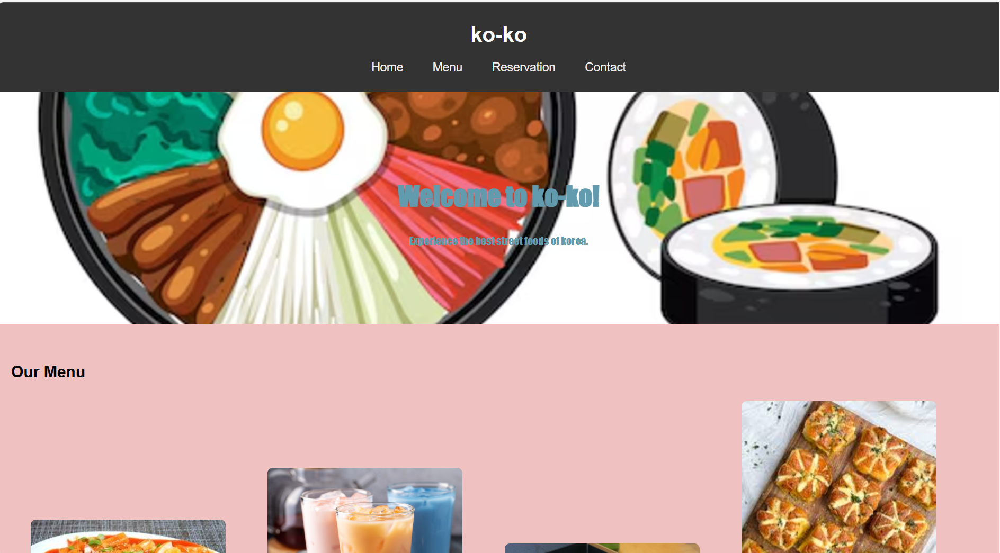
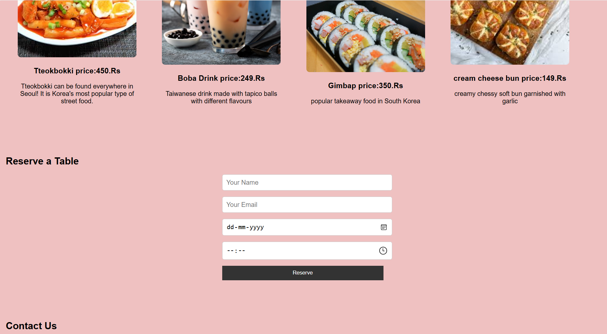
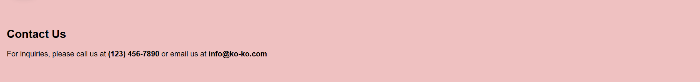

# Ex.07 Restaurant Website
## Date:29/11/24

## AIM:
To develop a static Restaurant website to display the food items and services provided by them.

## DESIGN STEPS:

### Step 1:
Requirement collection.

### Step 2:
Creating the layout using HTML and CSS.

### Step 3:
Updating the sample content.

### Step 4:
Choose the appropriate style and color scheme.

### Step 5:
Validate the layout in various browsers.

### Step 6:
Validate the HTML code.

### Step 7:
Publish the website in the given URL.

## PROGRAM:
~~~
<!DOCTYPE html>
<html lang="en">
<head>
  <meta charset="UTF-8">
  <meta name="viewport" content="width=device-width, initial-scale=1.0">
  <title>ko-ko</title>
  <link rel="stylesheet" href="style.css">
</head>
<body>
  <!-- Header Section -->
  <header>
    

      <h1>ko-ko</h1>
    

    <nav>
      <ul>
        <li><a href="#home">Home</a></li>
        <li><a href="#menu">Menu</a></li>
        <li><a href="#reservation">Reservation</a></li>
        <li><a href="#contact">Contact</a></li>
      </ul>
    </nav>
  </header>

  <!-- Home Section -->
  <section id="home">
    

      <h2>Welcome to ko-ko!</h2>
      
Experience the best street foods of korea.

    

  </section>

  <!-- Menu Section -->
  <section id="menu">
    <h2>Our Menu</h2>
    

      
      <h3>Tteokbokki price:450.Rs</h3>
      
Tteokbokki can be found everywhere in Seoul! It is Korea's most popular type of street food.

    

    

      
      <h3>Boba Drink price:249.Rs</h3>
      
Taiwanese drink made with tapico balls with different flavours

    

    

      
      <h3>Gimbap price:350.Rs</h3>
      
popular takeaway food in South Korea

    

    

      
      <h3> cream cheese bun price:149.Rs</h3>
      
creamy chessy soft bun garnished with garlic

    

  </section>

  <!-- Reservation Section -->
  <section id="reservation">
    <h2>Reserve a Table</h2>
    <form id="reservation-form">
      <input type="text" id="name" placeholder="Your Name" required>
      <input type="email" id="email" placeholder="Your Email" required>
      <input type="date" id="date" required>
      <input type="time" id="time" required>
      <button type="submit">Reserve</button>
    </form>
  </section>

  <!-- Contact Section -->
  <section id="contact">
    <h2>Contact Us</h2>
    
For inquiries, please call us at <strong>(123) 456-7890</strong> or email us at <strong>info@ko-ko.com</strong>

  </section>

  
  

  
</body>
</html>

~~~
~~~
/* Global Styles */
body {
    font-family: Arial, sans-serif;
    margin: 0;
    padding: 0;
    box-sizing: border-box;
    background-color: rgb(239, 193, 193);
  }
  
header {
    background-color: #333;
    color: white;
    padding: 10px 0;
    text-align: center;
  }
  
header nav ul {
    list-style: none;
    padding: 0;
  }
  
header nav ul li {
    display: inline;
    margin: 0 20px;
  }
  
header nav ul li a {
    color: rgb(244, 241, 241);
    text-decoration: none;
    font-size: 18px;
  }
  
section {
    padding: 40px 20px;
  }
  
#home {
    background: url('korean\ food.avif') no-repeat center/cover;
    color: rgb(98, 154, 174);
    text-align: center;
    padding: 100px 0;
    font-family:fantasy
  }
  
.hero h2 {
    font-size: 40px;
  }
  
.menu-item {
    display: inline-block;
    width: 20%;
    margin: 10px 2%;
    text-align: center;
  }
  
.menu-item img {
    width: 100%;
    border-radius: 8px;
  }
  
button {
    background-color: #333;
    color: white;
    padding: 10px 20px;
    border: none;
    cursor: pointer;
  }
  
button:hover {
    background-color: #555;
  }
  

  
form {
    display: grid;
    gap: 15px;
    max-width: 400px;
    margin: 0 auto;
  }
  
input[type="text"],
input[type="email"],
input[type="date"],
input[type="time"] {
    padding: 10px;
    font-size: 16px;
    width: 100%;
    border: 1px solid #ccc;
    border-radius: 5px;
  }
~~~
~~~
document.getElementById("reservation-form").addEventListener("submit", function(event) {
    event.preventDefault();
  
    const name = document.getElementById("name").value;
    const email = document.getElementById("email").value;
    const date = document.getElementById("date").value;
    const time = document.getElementById("time").value;
  
    if (name && email && date && time) {
      alert("Your table has been reserved!");
    } else {
      alert("Please fill in all fields.");
    }
  });
~~~

## OUTPUT:

## RESULT:
The program for designing software company website using HTML and CSS is completed successfully.
